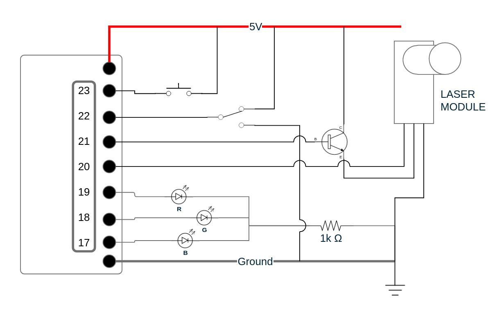

# linda_py

Laser Interface Networking Doohickey for AMSAT -- MicroPython Implementation

## Overview

The Laser Interface Networking Doohickey for AMSAT (LINDA) is a subsystem which implements proof-of-concept laser communications for the [AMSAT CubeSatSim](https://github.com/alanbjohnston/CubeSatSim). It is designed around a Sparkfun Thing Plus RP2040 microcontroller, and uses a generic 650nm laser pointer and laser sensor to implement a basic free-space optical communication link between two LINDA subsystems.

### Block Diagram


### Wiring Diagram



### Laser Submodule Flowchart


### Installation

This should be able to be run on any RP2040-based microcontroller, although I could only get reliable timer usage from Sparkfun boards: [Sparkfun Pro Micro RP2040](https://www.sparkfun.com/products/18288) and [Sparkfun Thing Plus RP2040](https://www.sparkfun.com/products/17745).

#### Micropython on RP2040

There are plenty of tutorials on how to set up your microcontroller for Micropython, so I won't do that here. Go to the [MicroPython downloads page](https://micropython.org/download/?mcu=rp2040) and get your microcontroller's firmware, flash it, etc etc.

I found that flashing the Sparkfun Thing Plus RP2040 firmware caused intermittant issues, which were remedied by flashing the normal Raspberry Pi Pico version instead.

#### Micropython Stubs

You should install the [Micropython Stubs](https://github.com/Josverl/micropython-stubs) to make life easier while developing in an IDE. The micropython-stubs github repo has more information.

The simplest approach is to install in a typings folder. Run the following command in the directory of this repo: ```pip install -U micropython-rp2-stubs micropython-rp2-pico-stubs --no-user --target ./typings```

That will install the relevant stubs in a ```typings/``` directory.

#### Micropython Libraries

Micropython supports the loading of packages to a microcontroller. See the [Micropython Wiki](https://docs.micropython.org/en/latest/reference/packages.html#packages) for details on package management.

Packages which are included in the [micropython-lib](https://github.com/micropython/micropython-lib) can be installed easily. The LINDA project requires the following:

* os
* logging

They can be installed by following the Wiki instructions to install ```mpremote``` and, with your RP2040 controller connected to the computer (after flashing the Micropython firmware), running: ```mpremote mip install [library]```

This will download the given library from the micropython-lib and freeze the files onto the filesystem of the attached controller.

NOTE: if you clear the flash of your microcontroller for any reason, you will have to re-install the libraries as outlined above

#### VS Code Environment

I developed all of the LINDA codebase using VS Code as an IDE. Install:

* [MicroPico](https://marketplace.visualstudio.com/items?itemName=paulober.pico-w-go)

Follow the instructions to install the MicroPico extension, including the "Getting started" section. This should configure VS Code to have various MicroPico-related buttons on the bottom bar, including "Pico Connected/Disconnected", "Run", and "Reset".

#### Loading LINDA Software

Connect the RP2040 microcontroller to your computer and wait for the VS Code bottom bar to change to "Pico Connected". You should be able to click "Run" and interct with the microcontroller using the MicroPython REPL.

In ```libraries/gpio.py```, define the pin numbers for each component for your specific setup.

With the file explorer selected, right-click on main.py and choose "Upload project to Pico". Depending on the specific configuration of your MicroPico extension, this will either upload the entire project .py files to the microcontroller, or just the main.py. Either way, you should be able to monitor which files are being loaded on the bottom status bar. Make sure that main.py and the entire libraries/ diretory are uploded. This process writes the files to the RP2040 flash memory.

MicroPython will run code found in main.py upon boot, whether attached through USB to a computer or a power supply. When connected to a computer, you can press the physical reset button on the board to have it connect to VS Code and provide access to the REPL.